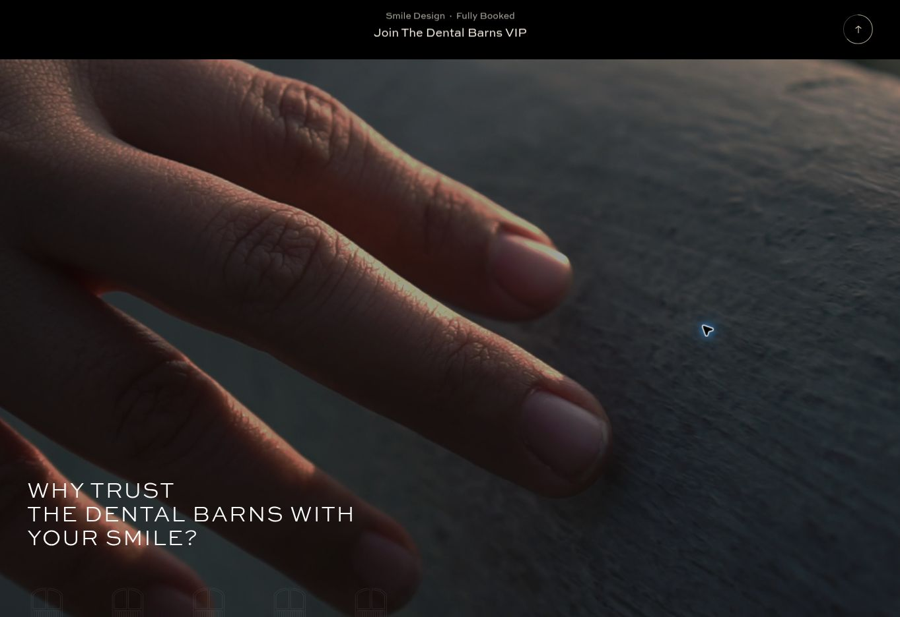

# Staging verification

Release: `ba1f9cac77c094fcb0f725398d9b3e8556faa7c9` (controller v1.2.0).
Staging: https://dentalbarns.webflow.io/
Publication task: `05e7e105-9ce4-4655-a170-b40bed2d6bac`, Webflow subdomain only,
no custom domains. All other site-head content was compared and preserved
exactly when changing the single Vimeo loader pin. No site-footer edits.

The controller, loader and fallback stylesheet fetched from the new immutable
CDN pin matched the local files byte for byte. GitHub blob hashes and the full
release tree also matched the local tree before the pin was changed.

## Real staging playback

Browser viewport: 1363 × 936, 6 October 2026.

| Check | Observed result |
| --- | --- |
| USP playing in its section | Actual iframe video: paused=false, muted=true, readyState=4 |
| Scroll away from USP | Actual video: paused=true at 30.783902 seconds |
| Return to USP | Actual video: paused=false from the same playback position |
| Hero initial play | Visible desktop film 1157563595 plays; hidden mobile iframe stays empty |
| Hero manual pause | Actual video paused at 22.391962 seconds; controls show paused |
| Scroll away/back after manual pause | Still paused at the same playback position |
| Hero manual resume | Actual video paused=false, muted=true |
| Poster reveal | ambient-started=true, placeholder-hidden=true after playback starts |
| Native fade | opacity 0.45s; visibility 0s delayed 0.45s, unchanged |
| Shared dependencies | One Vimeo loader, one controller, one Vimeo SDK; global UI CSS supplies states |
| Runtime errors | No Vimeo errors in the browser log during these checks |

## Geometry

The USP parent, root and inner wrapper remain x=0, y=0, width=1363,
height=936 while sticky. The iframe remains x=-151.53125, y=0,
width=1666.078125, height=936. These are exact matches to the pre-change
browser measurements, including the horizontal crop.

Published Webflow CSS was checked in addition to Designer readback. The
`is-ambient` combos override duplicated viewport constraints at all breakpoints.
The outer parent retains 100vw × 100vh and the iframe retains minimum width
178vh / minimum height 58vw at desktop, tablet and mobile. Percent dimensions
therefore resolve to the same parent dimensions, including landscape cropping.
Physical mobile-device rendering was not exercised in this browser session.

The 13 source/dist contract tests cover content-video consent, sound, manual
pause, pending-load cancellation, end state and page suspension. This session's
real iframe playback checks were hero and USP; a live manual content player was
not found on the inspected public pages. Hidden-document lifecycle was tested
deterministically, not by claiming a physical app-switch test.

## Performance interpretation

The compressed shared JS grows by 743 bytes (about 0.7 KiB), downloaded once
per eligible page, because cancellation and suspension checks add more code
than consolidating the duplicate reveal/pause paths removes. This is not a
measured Designer speed improvement. Designer loses one empty element and six
unused attributes, and gains four small native style combos to scope the layout
without altering other instances. The runtime benefit is preventing stale or
hidden-page playback; no quantitative CPU, memory or Designer-speed claim was
made or measured. Normal offscreen pausing already existed before this change.
